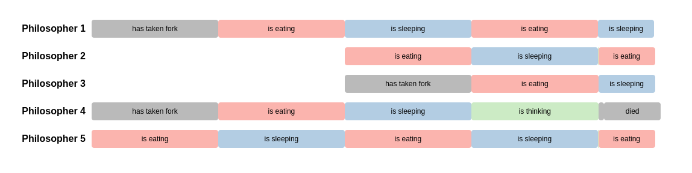

# Welcome to philosophers!

The <em>Dining Philosophers problem</em>, originally formulated by Edsger Dijkstra, is a classic example used to illustrate challenges in concurrent programming, such as data races and deadlocks.
This project is 42’s take on the problem — and this repository contains my solution.

#### Disclaimer for other 42 students
This project is intended to be a learning exercise for 42 students. Please do not copy, fork, or steal code from this repository to submit as your own. The aim of the project is to help you learn, not just complete the assignment. If you’re stuck, work through the problem, ask for help, or discuss it with peers, but do not simply use other students' solutions. We believe in the value of learning through challenges, and that’s the only way you’ll truly grow and succeed at 42. Let’s keep it fair and fun!

# Installation & Setup
## Dependencies

- A Unix-like operating system (e.g., Linux or macOS)  
- GNU Make  
- GCC or Clang  
- POSIX Threads library (`pthread`) — typically preinstalled on Unix-like systems

## One-Line Installation
```bash
git clone git@github.com:atdeters/philosophers.git && cd philosophers && make
```
## Running the philosophers program
These are the inputs for the program. The order is important here.
<ul>
	<li>nb: number of philosophers</li>
	<li>ttd: time to die (since last meal)</li>
	<li>tts: time to sleep</li>
	<li>nbte: number of times each philosopher has to eat before the simulation stops(this one is optional)</li>
</ul>
```bash
./philo [nb] [tte] [tts] [nbte]
```
## Examples
As an example of a successful execution with an odd amount of philosophers use the following command:
```bash
./philo 5 610 200 200 5
```

</img>

As an example of a successful execution with an even amount of philosophers use the following command:
```bash
./philo 6 402 200 200 5
```

</img>

As an example for an unsuccesful execution use the following command:
```bash
./philo 5 300 200 200 5
```

Another interesting case is only having a single philsopher in the simulation.
The will never be able to get the second fork and will just die after the time 
to die:
```bash
./philo 1 500 200 200
```

</img>

# Problem Explanation
There are <strong>n</strong> philosophers sitting around a circular table. Between each pair of philosophers lies a single fork.  
The challenge? They're trying to eat a particularly tricky kind of spaghetti — and they need <strong>two forks</strong> to do so.

Each philosopher follows a routine: <em>eating</em>, <em>sleeping</em>, and <em>thinking</em>. They can only do one activity at a time. They can't communicate with each other, and they can’t use someone else’s fork unless it’s available on the table.

And of course — they should avoid dying.

The simulation allows us to configure several parameters:

- the <strong>number of philosophers</strong>  
- <strong>time to die</strong>  
- <strong>time to eat</strong>  
- <strong>time to sleep</strong>  
- <em>(optional)</em> the <strong>number of times each philosopher must eat</strong> before the simulation ends successfully

# The Simulation as a program
In the program, each philosopher is represented as a separate thread using the <strong>pthread</strong> library.  
The forks are represented as <strong>mutexes</strong>.

Each philosopher runs in an infinite loop, going through their daily routine one action at a time.  
Another thread, the so-called <em>death thread</em>, continuously checks whether a philosopher has died — if so, the simulation stops immediately.

All actions are logged to the standard output in the following format:  
<code>[timestamp] [philosopher number] [action]</code>

[IMAGE OF NORMAL OUTPUT]

# Difficulties
Using multithreading in a programm causes new difficulties that need a special kind of treatment. 
## Deadlocks
<strong>⚠️ Problem</strong><br>
Deadlocks occur when multiple threads are each waiting on a resource that another thread is holding — causing a standstill.  
In this simulation, a deadlock can happen if every philosopher picks up their left fork first and then waits for the right one.  
If all philosophers do this at the same time, they’ll be stuck waiting forever.

<br><strong>💡 Solution</strong><br>
To prevent this, we alternate the order in which philosophers pick up forks:
<ul>
	<li>Odd-numbered philosophers pick up their <strong>right</strong> fork first</li>
	<li>Even-numbered ones pick up their <strong>left</strong> fork first.</li>
</ul>
This ensures that at least one philosopher will always be able to proceed, breaking the potential for a deadlock.


## Data Races
<strong>⚠️ Problem</strong><br>
A data race occurs when multiple threads access the same resource simultaneously, and at least one of them writes to it — leading to unpredictable behavior.  
For example, if 10 threads try to increment the same counter at once, some updates might be lost.

<em>Why?</em>  
Under the hood, each thread might load the value into its own CPU register, increment it, and write it back —  
but if two threads do this at the same time, they can overwrite each other’s result. This happens because the operation isn't truly atomic.

<br><strong>💡 Solution</strong><br>
We use <strong>mutexes</strong> to protect shared resources.  
A mutex ensures that only one thread can access a piece of data at a time: it <em>locks</em> the resource, and other threads must wait until it's <em>unlocked</em> before continuing.  
This guarantees safe read/write access and prevents data races.


## Interleaved Printing
<strong>⚠️ Problem</strong><br>
The same kind of issue can happen when philosophers log their actions.  
If multiple threads try to print to the standard output at the exact same time, their messages can interleave — resulting in unreadable or jumbled output.

<br><strong>💡 Solution</strong><br>
To prevent this, we use a <strong>mutex</strong> to guard all printing to <code>STDOUT</code>.  
By locking access to the output stream, we ensure that only one thread can print at a time — keeping the logs clean and readable.


## Unnecessary Starvation
<strong>⚠️ Problem</strong><br>
When multiple philosophers compete for the same fork, there's no guarantee that everyone will get a fair chance to eat.  
A philosopher might repeatedly lose the race for the fork, while another — who just finished eating — wins again, simply because they're faster.

The image below illustrates this problem:  
Philosopher 4 starves because they continuously lose access to the shared fork to Philosopher 5, who already ate but manages to grab the fork again before 4 can.  
Despite having enough time in theory, unfair competition leads to 4's untimely death.


</img>

<br><strong>💡 Solution</strong><br>
To avoid this kind of unfair starvation, we introduce small delays in the thinking time of certain philosophers.  
In this version:

- even-numbered philosophers are delayed by <strong>20ms</strong>  
- philosopher 1 is delayed by <strong>30ms</strong>  
- for each new round, the delay shifts to the next odd-numbered philosopher (1st, then 3rd, then 5th, etc.)

This way, philosophers alternate more fairly in who gets to act first.  
As shown in the diagram below, the brief green "thinking time" blocks ensure smoother and more balanced fork access.


</img>

If the <strong>time to eat</strong> is greater than the <strong>time to sleep</strong>, this delay strategy alone isn't enough.  
In that case, philosophers are still forced to wait for others to finish eating — the delay becomes ineffective.

To handle this, we adjust the delay dynamically:  
we add <code>(time_to_eat - time_to_sleep)</code> to the base delay.  
This compensates for the unavoidable waiting time and helps maintain fairness in more demanding configurations.

# Special Thanks
I highly recommend checking out the <a href="https://rom98759.github.io/Philosophers-visualizer/" target="_blank" rel="noopener noreferrer">philosophers visualizer</a> from [rom98759](https://github.com/rom98759) who is student at 42 Angoulême. It is a super helpful tool to visualize the output of the program and to identify possible problems in your code. The Images used in this README have been made using this tool.