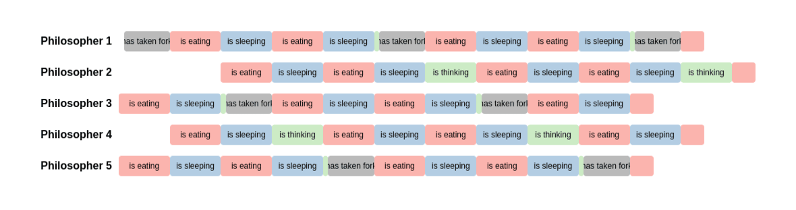
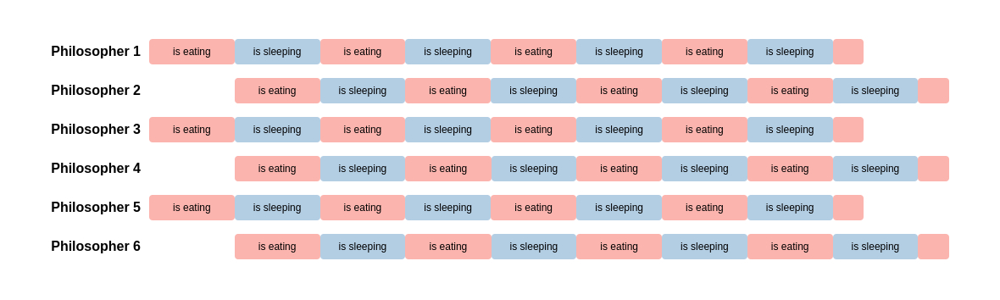
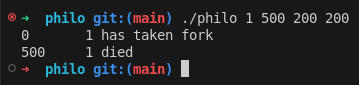

# Welcome to philosophers!

The philosophers dining problem, originally formulated by Edsger Dijkstra is a classic problem that
shows the problem of concurrent programs / multithreading such as Data Races and Deadlocks.
This is 42s take on the problem and my solution to this problem.

#### Disclaimer for other 42 students
This project is intended to be a learning exercise for 42 students. Please do not copy, fork, or steal code from this repository to submit as your own. The aim of the project is to help you learn, not just complete the assignment. If you’re stuck, work through the problem, ask for help, or discuss it with peers, but do not simply use other students' solutions. We believe in the value of learning through challenges, and that’s the only way you’ll truly grow and succeed at 42. Let’s keep it fair and fun!

# Installation & Setup
## Dependencies
## Downloading it
## Running it
### Usage


### Examples
As an example of a successful execution with an odd amount of philosophers use the following command:
```bash
./philo 5 610 200 200 5
```

</img>

As an example of a successful execution with an even amount of philosophers use the following command:
```bash
./philo 6 402 200 200 5
```

</img>

As an example for an unsuccesful execution use the following command:
```bash
./philo 5 300 200 200 5
```

Another interesting case is only having a single philsopher in the simulation.
The will never be able to get the second fork and will just die after the time 
to die:
```bash
./philo 1 500 200 200
```

</img>

# The Problem
## The Simulation
There are n philosophers sitting at a round table. Between every philosopher there is a single fork.
The problem is, that the type of spaghetti they are trying to eat is a difficult kind and therefore
they are in need of two forks to be able to eat. The daily routine of a philosopher consists of eating,
sleeping and thinking. They can only do one of those at the same time. They can also not communicate with
each other or take someone elses fork.
Also of course they should avoid dying. In the simulation we can give the program specific values for the amount of philosophers, 
the time to die, time to sleep and time to eat. Optionally we can add a value for the amount of times 
every philosopher needs to eat before the simulation succeeds

## The Simulation as a program
In the program every philosopher is represented as a single thread using pthread library. The forks are represented as mutexes.
Every philosopher loops indefinitely in a daily routine in which he does all the actions. Another thread called death thread
checks wheter someone has died already which will stop the simulation immediately.
Every action is logged on the standart output in the format: 
[Timestamp] [philosopher nb] [action]

[IMAGE OF NORMAL OUTPUT]

## Difficulties
Using multithreading in a programm causes new difficulties that need a special kind of treatment. 
### Dead Locks
Deadlocks occur when mulitple locks wait for each other to finish their task. As an example here we can imagine, that every
philosopher takes their left fork at the start of the simulation and waits for their right fork to be unlocked. In this situation
everyone will wait and therefore we will be stuck forever.
#### Solution to Dead Locks
Instead of letting everyphilosopher grab the same fork we let every odd numbered philosopher take the right and every even
numbered philosopher take the left fork first. This way we can never have the situation in which everyone is waiting for the
next persons fork.

### Data Races
When multiple threads are calling the same ressources a so called data race is possible. This means that for example if 10 threads
try to increase the same value some of them will get lost and not actually increase the variable [Add deeper explanation with what happens
in the background with registers and shit]
#### Solution
The solution is to protect these kinds of ressources using mutexes. What they do is to lock them and only allow the next thread to use
them after the initial thread unlocks them again. This way it can be ensured that only one thread reads or writes to this data at a time
and data races can not happen.

### Intervealed Printing
The same problem can occur for printing out the logs of what each philosopher is doing at a certain time. As these messages will
be printed exactly at the same time sometimes their characters can mix up into an unreadable mess.
#### Solution
The solution is also to use mutex for every function that prints to the STDOUT. This way only one thread can print at a time and
the messages will not get mixed up.

### Unneccesary starvation
When multiple philosophers are fighting over the same fork it is not guaranteed that everyone will get to eat. It might happen
that one wins over the other multiple times in a row so that the other one does not get to eat at all and therefore dies eventhough
the timings in the simulation would be enough for everyone to survive.
#### Solution
The solution to this unfair fighting over a fork is to manipulate the thinking time of certain philosophers to make the other one
win over the fork. In this version the even numbered philosophers are delayed by 20ms and the first philosopher is delayed by 30ms.
For every next round the next odd numbered philosopher will be delayed. So in the beginning the first, then the third, then the fifth
and so on. This way they will alternate nicely who will wait a bit more. 

[ADD IMAGE FROM TESTER]

If the time to eat is larger then the time to sleep this approach will not be enough yet, as they have to wait for the other philosopher
to finish eating anyways, so the delay will to nothing. For this case there is the logic that we add to our delay the time to eat minus 
the time to sleep to make up for this waiting time.

# Special Thanks
I highly recommend checking out the ["philosophers visualizer"](https://rom98759.github.io/Philosophers-visualizer/) from [rom98759](https://github.com/rom98759) who is student at 42 Angoulême. It is a super helpful tool to visualize the output of the program and to identify possible problems in your code. The Images used in this README have been made using this tool.